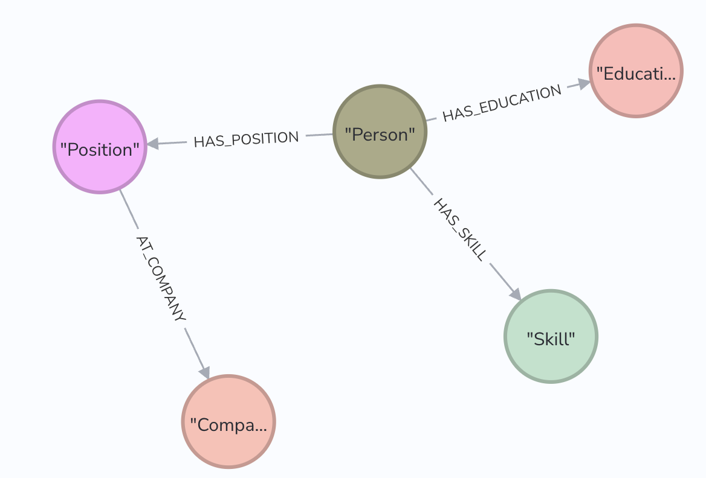
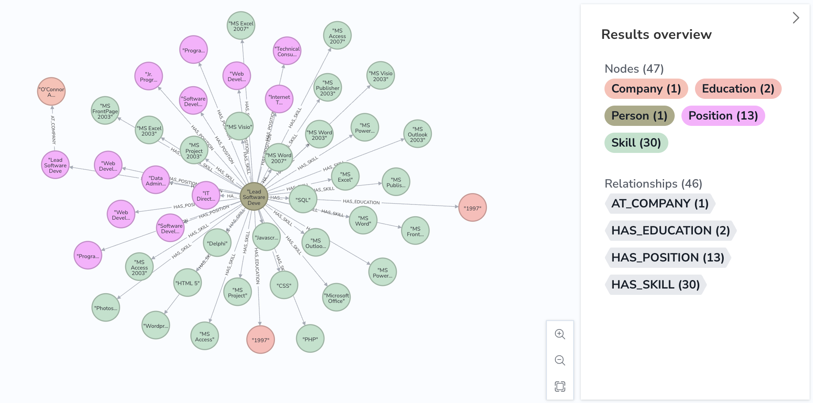
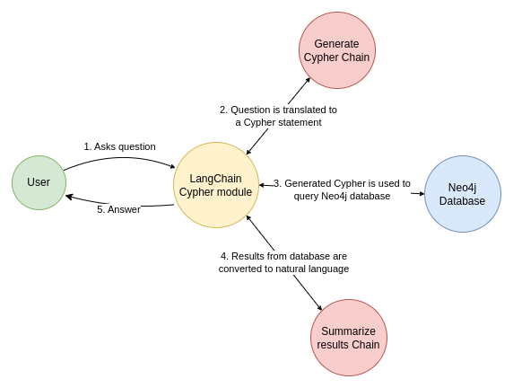

## Setup
To get started, we'll need to set up some resources:

### Step 1- Create OpenAI API key
[Generate an OpenAI API key](create_openai_key/README.md).


### Step 2- Create a conda environment after opening the repository

```bash
conda create -n GraphLLM python=3.7.6 -y
```

```bash
conda activate GraphLLM
```


### Step 3 - Install the requirements
```bash
pip install -r requirements.txt
```


### Step 4 - You will now need to edit that file to reflect your Azure OpenAI and Neo4j credentials. The file has the following variables:

    OPENAI_API_KEY = "" #OPENAI KEY
    OPENAI_API_TYPE = "azure"
    OPENAI_API_VERSION = "2023-03-15-preview"
    OPENAI_API_BASE = ""
    OPENAI_MODEL_NAME = "gpt-3.5-turbo"
    OPENAI_DEPLOYMENT_NAME = "gpt-3.5-turbo"
    NEO4J_URI = "neo4j+s://xxxxx.databases.neo4j.io" # Neo4j URL. Include port if applicable
    NEO4J_USER = "neo4j" # Neo4j User Name
    NEO4J_PASSWORD = "Foo12345678" #Neo4j Password


### Step 5 - Data Preparation 
First we need to extract knowledge adhering to the following schema. This is a very simplified schema to denote a Resume.

To achieve our Extraction goal as per the schema, we are going to chain a series of prompt as defined in above figure those you can get in `Prompts.py`.
And then we prepared a pipeline to extract the Entities and Relations by iterate through each 'Resume.txt' file with the help of `gpt-3.5 turbo` base model.


### Step 6 - Data Ingestion
After extracting the Entities and Relations of each Resume.txt document, we need to ingest the data into a graph database for further query context search purpose. Here we are utilizing the `Neo4j` graph database to leverage the benefits of Knowledge Graphs in our LLM applications for showcasing. Therefore in order to ingest the data here we have prepared a pipeline that consist of two phases: First we need to convert the extracted entities and relations of each Resume document into a Cypher query, second we ingest the data of that Resume document into Neo4j database with the help of this generated Cypher query. Therefore in order to ingest the data into your Neo4j Graph database you just need to setup your Neo4j ID credentials and run `DataIngestion.py`. Your ingested data might look like this: 



### Step 7 - Data Consumption
After successfully completing your Data ingestion your data get stored in the format of Knowledge graphs as you can see in above figure. Now your task is to consume related data from your Neo4j database according to your query. So, in order to consume the data we should send the user query to the database in the form of Cypher instead of Natural human language. For that we have followed two phase: First we finetuned a model with some data that you can see in `finetuning` folder in order to generate a Cypher query from User's query, second we consume the data from the Neo4j database with the help of this Cypher query. Therefore in order to consume the data from your Neo4j Graph database you just need to setup your Neo4j ID credentials and run `DataConsumption.py`.

###### NOTE: Here we tried to finetune Azure OpenAI Finetune models `gpt-3.5-turbo(0613)`, but here we failed because of no credentials of these finetune models in order to access them. But you can finetune if you have credentials.


### Step 8 - Now we can run the app with the command:
Therefore here I have failed to fintune the model so in alternate I have been using the `Langchain` Framework to quickly build a chatbot that converts English to Cypher and then executes it on Neo4j. This is augmented using generative AI before sending the response to the user. This makes graph consumption easier for non-Cypher experts. We will be using Gradio to quickly try out chatbot that uses a base model. Once chatOpenAI LLM is integrated into Langchain, you will get support for adapter tuned model as well. But here we failed to finetune our base model due to unavaialability of resources for fine tuning. That's why we have used ChatOpenAI from Langchain framework.



Running the code below will render a chat widget.You can view the Cypher generated for your input below this rendering.

Note - Due to quota limitations, you might see errors while submitting the input. You need to wait a while in between your queries.

```
python TalentFinderChatbot.py
```


## Some sample questions to try out:

1. How many experts do we have on MS Word?
2. Who went to most number of universities and how many did they go to?
3. Where do most candidates get educated?
4. How many people know Delphi?


## Author

👤 **Thiresh Sidda**

* LinkedIn: [@ThireshSidda](https://www.linkedin.com/in/thiresh-sidda)
* GitHub: [@ThireshSidda](https://github.com/Thireshsidda)


